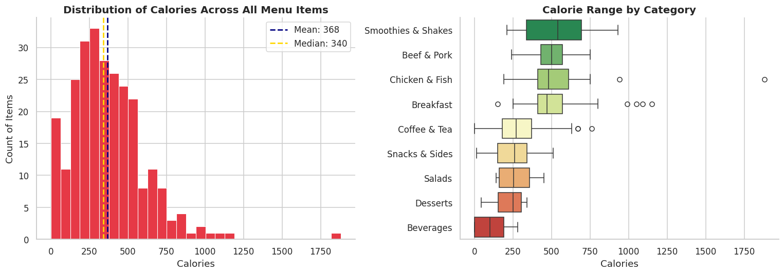
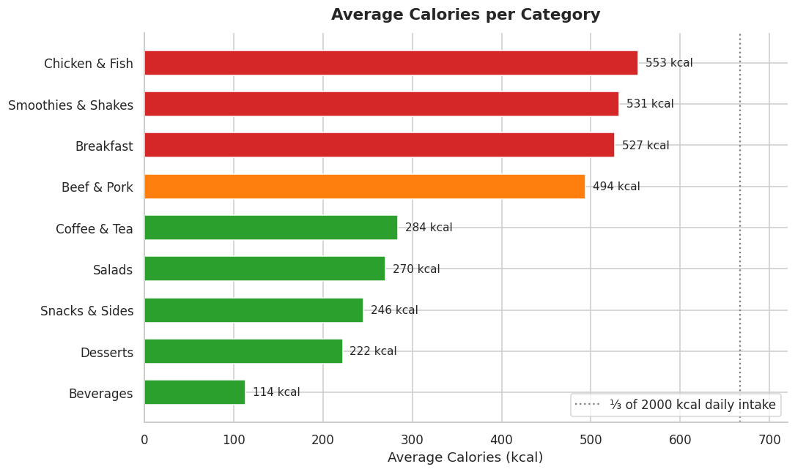
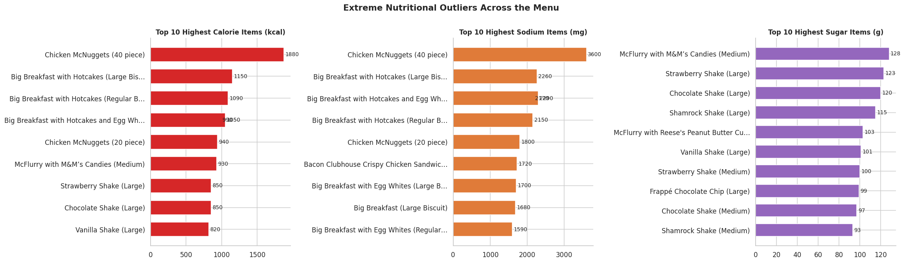
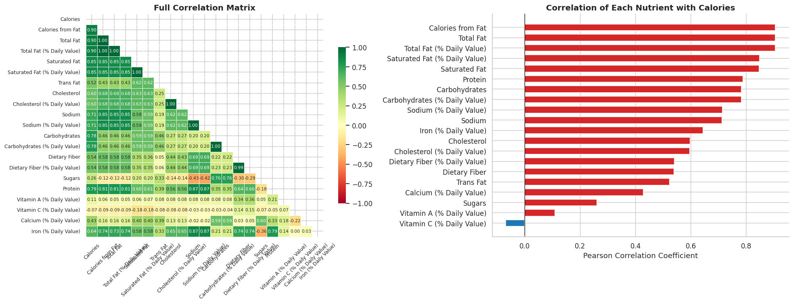

# 🍔 McDonald's Menu Nutrition Analysis

> An end-to-end Exploratory Data Analysis of the full McDonald's menu — uncovering calorie patterns, sodium risks, sugar outliers, and macronutrient profiles across all 9 food categories.

---

## 📌 Project Overview

This project analyses the nutritional content of **260 McDonald's menu items** across **9 categories** using Python. The goal is to go beyond surface-level calorie counts and uncover the full nutritional story — which categories are most calorie-dense, which items are sodium bombs, and what actually drives calorie content.

**Dataset Source:** [McDonald's Menu — Kaggle](https://www.kaggle.com/datasets/mcdonalds/nutrition-facts)

---

## 🔑 Key Findings

| # | Finding |
|---|---------|
| 1 | **Chicken & Fish is the highest-calorie category** (avg 553 kcal) — more than Beef & Pork |
| 2 | **Smoothies & Shakes are deceptively unhealthy** — avg 531 kcal; 9 of the top 10 sugar-heavy items |
| 3 | **The 40-piece McNuggets** tops the extremes: 1,880 kcal and 3,600 mg sodium (156% of daily limit) |
| 4 | **Total Fat is the strongest calorie predictor** (r = 0.904) — not sugar (r = 0.26) |
| 5 | **Saturated Fat averages 30% Daily Value** across all items — consistently in the "high" zone |
| 6 | **Breakfast items average 1,211 mg sodium** per item — over 60% of WHO's daily recommendation |
| 7 | Only **16 items are zero-calorie**, all beverages — food options are uniformly calorie-significant |
| 8 | **Salads offer the best nutritional balance**: moderate protein, lower sodium, reasonable calories |

---

## 📊 Visualisations

| Chart | Description |
|-------|-------------|
| `01_calorie_distribution.png` | Histogram and boxplot of calories across all items and categories |
| `02_avg_calories_by_category.png` | Average calories per category ranked and annotated |
| `03_top_extreme_items.png` | Top 10 items by calories, sodium, and sugar side-by-side |
| `04_macronutrient_by_category.png` | Grouped bar: protein vs fat vs carbs by category |
| `05_sodium_analysis.png` | Average sodium vs WHO daily limit, by category |
| `06_correlation_analysis.png` | Full correlation heatmap + calorie-specific correlation bar chart |
| `07_daily_value_pct.png` | Average % Daily Value per nutrient across all menu items |
| `08_column_distributions.png` | Distribution histograms for all 12 numeric nutritional columns |

> All visuals are auto-generated into the `visuals/` folder when the notebook is executed.

### Preview

<table>
  <tr>
    <td></td>
    <td></td>
  </tr>
  <tr>
    <td></td>
    <td></td>
  </tr>
</table>

---

## 🗂️ Repository Structure

```
mcdonalds-nutrition-eda/
│
├── McDonald_s_Menu_Nutrition_Analysis.ipynb   # Main analysis notebook
│
├── data/
│   └── menu.csv                               # Raw dataset (260 items × 24 columns)
│
├── visuals/                                   # Auto-generated chart exports (PNG)
│   ├── 01_calorie_distribution.png
│   ├── 02_avg_calories_by_category.png
│   ├── 03_top_extreme_items.png
│   ├── 04_macronutrient_by_category.png
│   ├── 05_sodium_analysis.png
│   ├── 06_correlation_analysis.png
│   ├── 07_daily_value_pct.png
│   └── 08_column_distributions.png
│
└── README.md
```

---

## 🛠️ Tech Stack

| Tool | Purpose |
|------|---------|
| **Python 3.10+** | Core language |
| **Pandas** | Data loading, cleaning, aggregation |
| **NumPy** | Numerical operations and correlation |
| **Matplotlib** | Custom chart rendering |
| **Seaborn** | Statistical visualisations and styling |

---

## 🚀 Getting Started

### 1. Clone the repository
```bash
git clone https://github.com/YOUR_USERNAME/mcdonalds-nutrition-eda.git
cd mcdonalds-nutrition-eda
```

### 2. Install dependencies
```bash
pip install pandas numpy matplotlib seaborn notebook
```

### 3. Launch the notebook
```bash
jupyter notebook McDonald_s_Menu_Nutrition_Analysis.ipynb
```

Run all cells — charts will be saved to `visuals/` automatically.

---

## 📁 Dataset Description

**File:** `data/menu.csv`  
**Rows:** 260 menu items  
**Columns:** 24 nutritional attributes

| Column Group | Columns |
|---|---|
| **Identifiers** | Category, Item, Serving Size |
| **Calories** | Calories, Calories from Fat |
| **Fats** | Total Fat, Saturated Fat, Trans Fat (+ % DV for each) |
| **Other macros** | Cholesterol, Sodium, Carbohydrates, Dietary Fiber, Sugars, Protein (+ % DV) |
| **Micronutrients** | Vitamin A, Vitamin C, Calcium, Iron (% DV only) |

**Categories:** Breakfast · Beef & Pork · Chicken & Fish · Salads · Snacks & Sides · Desserts · Beverages · Coffee & Tea · Smoothies & Shakes

---

## 💡 Potential Extensions

- **Calorie prediction model** — Linear/Ridge regression using fat, protein, carbs as features
- **Nutritional clustering** — K-Means to group items by macro similarity
- **Per-100g normalisation** — Fairer comparison across different serving sizes
- **Interactive dashboard** — Streamlit or Plotly Dash version for live filtering

---

## 📄 License

This project is open source under the [MIT License](LICENSE).  
Dataset is publicly available via Kaggle — original source: McDonald's USA.

---

*If you found this useful, feel free to ⭐ the repo!*
